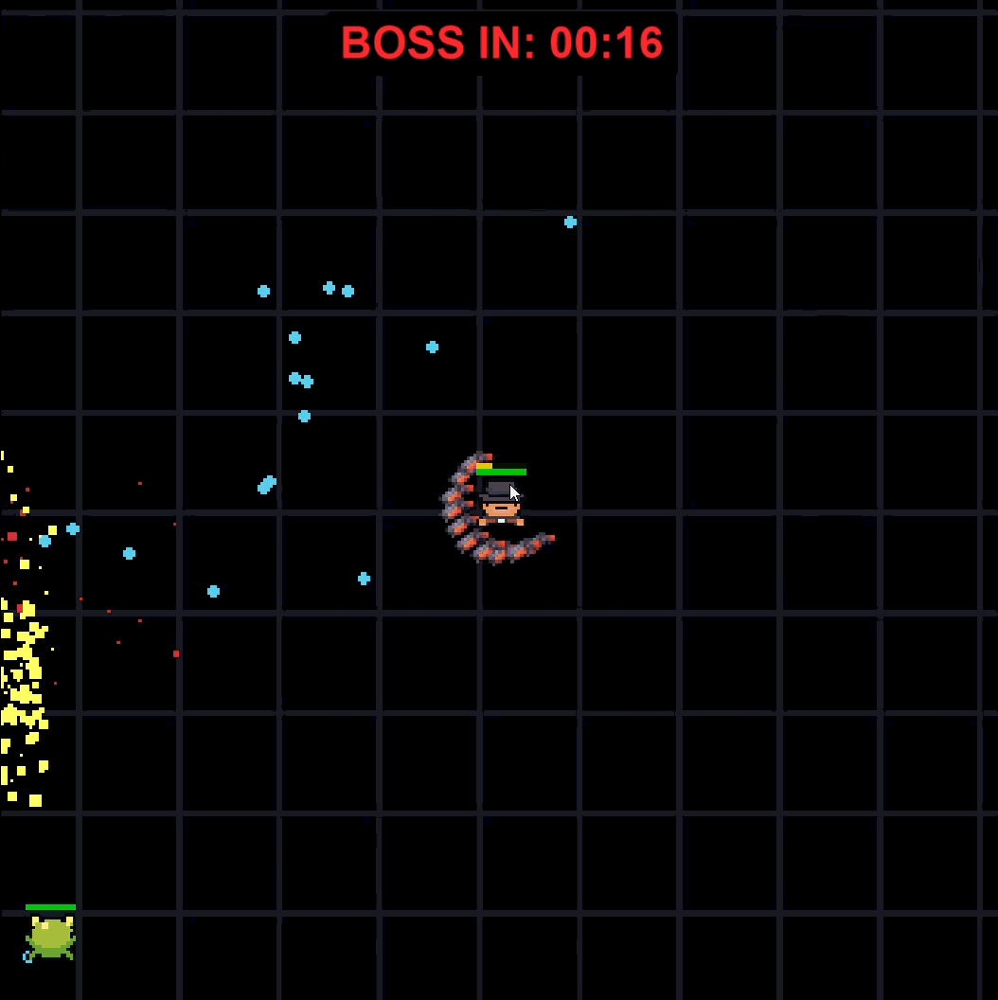

# 🧟‍♂️ Normie Survival


> **An intense, highly-optimized arena survival shooter built entirely from scratch in Python. Features a custom Entity-Component-System (ECS), bespoke flow-field pathfinding, and a hardware-accelerated UI caching engine to maintain a locked 60 FPS.**


## 📖 The Hook

The horde doesn't stop, and neither do you. 

You are dropped into an infinite grid with nothing but a base weapon and a 3-minute timer. As you decimate the Red Cyclops swarm, you collect experience gems to augment your physical stats, bolt on retaliation tech, and expand your arsenal. 

But the AI Director is watching. As time ticks down, spawn rates multiply and elite enemies drop into the arena. Survive the onslaught, trigger the boss fight, and claim the Mega Gem—or die trying.

## 📸 Visual Showcase

### 1. The Arsenal (Weapon Mastery)


### 2. The Tesla Web (Area of Effect)


### 3. The Boss Encounter


## 🛠️ Technical Architecture (The Engine)

This game isn't just a massive `while` loop. It runs on a custom-built, highly decoupled engine designed to squeeze maximum performance out of Python without relying on pre-built physics nodes.

* **Entity-Component-System (ECS):** Pure separation of data and logic. Systems (Movement, Collision, Combat, Rendering) process data arrays independently, preventing spaghetti code and allowing for massive scalability.
* **Flow-Field Pathfinding:** Instead of A^* calculating 200 individual paths per frame, the engine calculates a single, unified "gravity map" once per second, allowing the entire horde to navigate perfectly around the player at a fraction of the CPU cost.
* **Hardware-Accelerated UI Caching:** To prevent Pixel Fill-Rate bottlenecks, 1080p UI panels are generated, scaled, and cached into memory via a "Dirty Flag" system, reducing UI rendering time from 40ms to 0.1ms per frame.
* **Spatial Hashing:** Collision detection operates on a dynamic discrete grid system, dropping complexity from $O(N^2)$ to near $O(1)$, ensuring smooth frame rates even when the arena is completely flooded.

## 🚀 Installation & How to Play

### Prerequisites
* Python 3.x
* Pygame

### Setup
1. Clone the repository:
   ```bash
   git clone [https://github.com/AnonymousXavier/Normie-Survival.git](https://github.com/AnonymousXavier/Normie-Survival.git)
   ```
2. Install the required dependencies:
   ```bash
   pip install pygame-ce
   ```
3. Run the engine:
   ```bash
   python main.py
   ```

## 🎮 Controls

* **[W, A, S, D]** or **[Arrow Keys]** - Move your character.
* **[Mouse]** - Aim your weapons.
* **[Auto-Fire]** - Weapons fire automatically based on their individual cooldown stats.
* **[ESC]** - Pause Game / Access Settings (Toggle Music, Sound, Screen Shake).

## 📊 Profiling & Optimization Notes
This engine was heavily profiled using `cProfile`. If you are a developer looking to fork or study the architecture:
* Toggle the live, unobtrusive FPS counter in the top-left to monitor performance under heavy load.
* Keep an eye on `ParticleManager.py` if altering the `lightning_bolts` life-cycle, as it relies on jagged mathematical interpolation.

## 📜 Credits
* **Developer:** Xavier
* **Engine:** Pygame-CE
